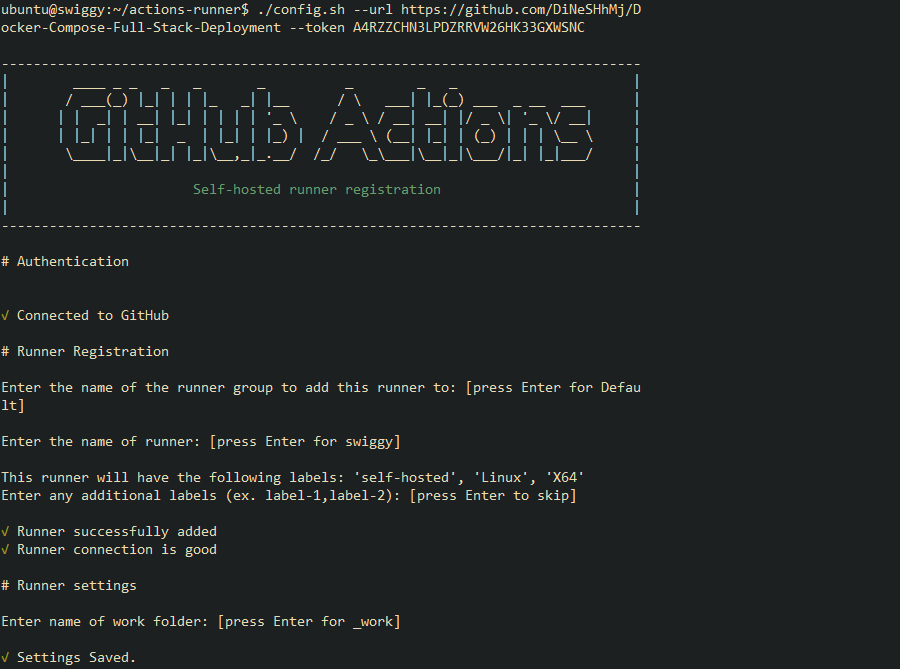
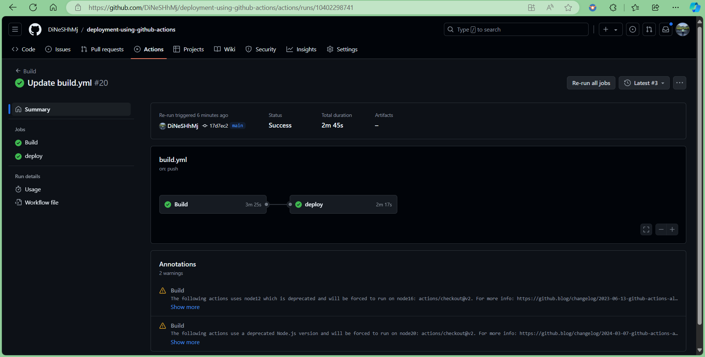

# Swiggy Clone Deployment using GitHub Actions

This project demonstrates the deployment of a Swiggy clone application using GitHub Actions as the CI/CD tool. It leverages Terraform for infrastructure automation on AWS, including EC2 and EKS services, DockerHub for container management, SonarQube for code quality checks, and Prometheus & Grafana for monitoring. Below are the detailed steps for deploying the application.

---

## 📋 Overview

This repository demonstrates the deployment of a Swiggy clone application using several tools and services:

- **Terraform**: Manages AWS infrastructure. 🌍
- **GitHub Actions**: Handles CI/CD workflows. 🤖
- **SonarQube**: Performs code quality checks. 🔍
- **DockerHub**: Manages Docker container images. 🐳
- **EKS**: Hosts the application in Kubernetes. 🚢
- **Prometheus & Grafana**: Monitors application performance. 📈

---

## 📦 Prerequisites

Ensure you have the following installed and set up:

| Tool                          | Installation Link                                                        |
|-------------------------------|---------------------------------------------------------------------------|
| **AWS CLI**                   | [Install AWS CLI](https://docs.aws.amazon.com/cli/latest/userguide/install-cliv2.html) 🌐 |
| **Terraform**                 | [Get Terraform](https://learn.hashicorp.com/terraform/getting-started/install) ⚙️ |
| **Docker**                    | [Get Docker](https://www.docker.com/get-started) 🐳                           |
| **DockerHub**                 | [Create DockerHub Account](https://hub.docker.com/signup) 🔑                   |
| **GitHub Account**            | [Create GitHub Account](https://github.com/join) 🧑‍💻                           |
| **SonarQube**                 | [SonarQube Documentation](https://docs.sonarqube.org/latest/) 📚              |
| **Prometheus**                | [Get Prometheus](https://prometheus.io/download/) 📊                          |
| **Grafana**                   | [Get Grafana](https://grafana.com/grafana/download) 📉                         |

---

## 🗂️ Table of Contents

1. [Prerequisites](#prerequisites)
2. [Project Structure](#project-structure)
3. [Setup Guide](#setup-guide)
   - [Step 1: Setup Terraform and Configure AWS](#step-1-setup-terraform-and-configure-aws)
   - [Step 2: Build Infrastructure with Terraform](#step-2-build-infrastructure-with-terraform)
   - [Step 3: Create IAM Role for EC2](#step-3-create-iam-role-for-ec2)
   - [Step 4: Setup GitHub Actions with EC2](#step-4-setup-github-actions-with-ec2)
   - [Step 5: Setup SonarQube and DockerHub](#step-5-setup-sonarqube-and-dockerhub)
   - [Step 6: Setup EKS Cluster](#step-6-setup-eks-cluster)
   - [Step 7: Build and Push Docker Image](#step-7-build-and-push-docker-image)
   - [Step 8: Deployment on Kubernetes](#step-8-deployment-on-kubernetes)
   - [Step 9: Monitoring via Prometheus and Grafana](#step-9-monitoring-via-prometheus-and-grafana)
4. [Clean Up](#clean-up)
5. [Project Resources](#project-resources)

## 📂 Project Structure

```
├── .github
│ └── workflows
│ └── build.yml
├── Eks-terraform
│ ├── backend.tf
│ ├── main.tf
│ └── provider.tf
├── Instance-terraform
│ ├── main.tf
│ ├── provider.tf
│ ├── script.sh
│ └── terraform.tfstate
├── public
├── src

```
## 🛠️ Setup Guide

### Step 1: Setup Terraform and Configure AWS

1. **Install Terraform**

    ```bash
    sudo su
    snap install terraform --classic
    which terraform
    ```

2. **Configure AWS CLI**

    - Create an IAM user on AWS with admin access.
    - Download the CSV file containing the access key and secret key.
    - Run `aws configure` on your terminal and input the access and secret keys.

### Step 2: Build Infrastructure with Terraform

1. Navigate to the `terraform` folder and update the `main.tf` file with your specific AMI ID and key pair.

2. Run the following Terraform commands:

    ```bash
    terraform init
    terraform validate
    terraform plan
    terraform apply --auto-approve
    ```

3. Check your AWS console for the created EC2 instance.

### Step 3: Create IAM Role for EC2

1. Create an IAM role for EC2 and attach the AdministratorAccess policy.
2. Attach the IAM role to your EC2 instance from the AWS console.

### Step 4: Setup GitHub Actions with EC2

1. In your GitHub repository, go to `Settings > Actions > Runners` and create a new self-hosted runner.
2. Follow the commands provided by GitHub to set up the runner on your EC2 instance.

### Step 5: Setup SonarQube and DockerHub

1. **SonarQube Setup:**

    - Access SonarQube through the EC2 instance’s public IP on port 9000.
    - Create a new project and generate a token.
    - Add the token as a GitHub secret in your repository.

2. **DockerHub Setup:**

    - Create an access token in DockerHub and add it as a GitHub secret in your repository.

### Step 6: Setup EKS Cluster

1. Clone the EKS Terraform folder from the GitHub repository:

    ```bash
    https://github.com/DiNeSHhMj/CICD-for-Swiggy-GitHub-Actions-Deployment
    cd deployment-using-github-actions/Eks-terraform
    ```

2. Run the following Terraform commands to create the EKS cluster:

    ```bash
    terraform init
    terraform validate
    terraform plan
    terraform apply
    ```

### Step 7: Build and Push Docker Image

1. Update the `build.yaml` file in the `.github/workflows` folder to include the Docker build and push steps.
2. Commit the changes, and GitHub Actions will trigger the pipeline to build and push the Docker image to DockerHub.

### Step 8: Deployment on Kubernetes

1. Update the `build.yaml` file to include Kubernetes deployment steps.
2. Run the deployment commands to deploy the Swiggy clone on the EKS cluster.
3. Check the deployment status with:

    ```bash
    kubectl get all
    ```

4. Access the application using the load balancer URL generated by EKS.

### Step 9: Monitoring via Prometheus and Grafana

1. **Prometheus Setup:**

    - Set up a new EC2 instance for Prometheus with at least 2 CPUs and 4GB memory.
    - Install Prometheus and Node Exporter.
    - Configure Prometheus to monitor the EKS cluster and the application.

2. **Grafana Setup:**

    - Install Grafana and configure it to pull metrics from Prometheus.
    - Create dashboards for monitoring the application's performance.

## 🧹 Clean Up

Once you're done, destroy the infrastructure using Terraform:

```bash
terraform destroy --auto-approve
```
 <h2>Deployment Outputs</h2>
  <p>This section showcases screenshots from various stages of the deployment process.</p>

<section>
    <h3>Github Actions</h3>
    
    
</section>

<section>
    <h3>SonarQube</h3>
    
</section>

<section>
    <h3>Kubectl Outputs</h3>
    
</section>

<section>
    <h3>Grafana</h3>
    
</section>

<section>
    <h3>Bingo!! Our Swiggy app is ready to place orders..</h3>
    
   
</section>


## ℹ️ Additional Notes

- **Testing and Validation**: Ensure that all components are thoroughly tested in a staging environment before deploying to production. Use unit tests and integration tests to verify functionality.
- **Security Considerations**: Review security best practices for AWS, Docker, and Kubernetes to safeguard your application and infrastructure. Regularly update dependencies and monitor for vulnerabilities.
- **Scaling and Performance**: Monitor the performance of your application and adjust resource allocation as needed. Consider using auto-scaling features of AWS and Kubernetes to handle varying loads.

Feel free to reach out if you have any questions or need further assistance with the deployment process. Happy deploying! 🚀

